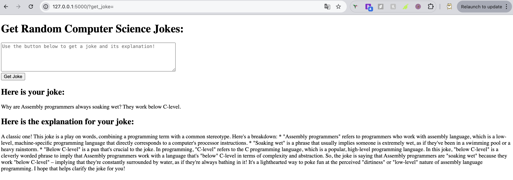

# Peter_Min_Data_Engineering_Individual_Project_3

[Demo Video on YouTube](https://youtu.be/85bLv4lr9Bs)
&nbsp;&nbsp;

This is the README for my Individual Project 3, which is about building a publicly accessible auto-scaling container using AWS Services and Flask app for the IDS706 - Data Engineering Systems class at Duke University.

## Overview
The idea of this project is to package an existing Flask app using Docker and using AWS to host the Docker image and make it publicly accessible using AWS ECR and AWS App Runner for auto-scaling feature.

For my Flask app, I integrated [Jokes API](https://sv443.net/jokeapi/v2/) with a LLM supported by (Groq)[https://console.groq.com/docs/overview]. When a user clicks the button, it will generate a random CS/programming-related joke and ask Llama to explain the joke to them.

To use the publicly-accessible app hosted by AWS, please visit [this link](https://3sybanupbh.us-east-2.awsapprunner.com/).

## Local Flask Run

## AWS App Runner Deployment

## AWS-hosted Domain Access

